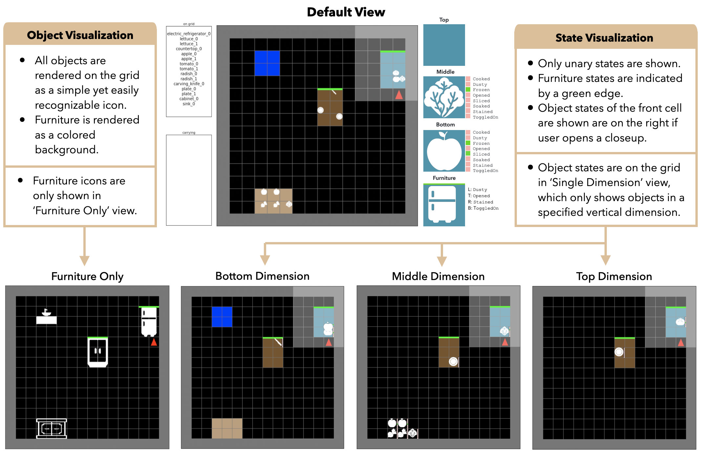

# Mini-BEHAVIOR
###  MiniGrid Implementation of BEHAVIOR Tasks 


Mini-BEHAVIOR is a simple and easy-to-use high-speed 3D-gridworld environment
with a high-level action space and a set of implementations of long-horizon, interaction-rich BEHAVIOR tasks.
Mini-BEHAVIOR includes 20 tasks of varying difficulty, 96 objects, 23 states, and 15 actions. 
The actions include 3 for navigation (forward, turn left, turn right) and 12 for manipulating objects in the environment 
(pick, place, open, close, etc). 
The tasks are instantiated in simulated household environments.

### Environment Setup
* Install gym-mingrid v1.0.3: 
```
pip install gym-minigrid==1.0.3
```
* Install gym v0.21.0: 
```
pip install setuptools==65.5.0
pip install gym==0.21.0
```
* (Optional) Install stable-baselines3: 
```
pip install stable-baselines3==1.6.2
```
* Install mini-behavior: 
```
pip install -e .
```

### Run Code 
* To run in interactive mode:
```
python manual_control.py
```
* To train a sample RL agent with stable-baseline3 installed:
```
python train_rl_agent.py
```
* Example trained RL agent:
<p align="center">
  
</p>

* To collect human demonstrations, run:
```
python manual_control.py --save true
```
* An example code for loading the demos is shown in load_demos.py

### Action Space Type
Mini-BH supports two types of action spaces: cartesian and primitive. Environment names that ends with v0 correspond to 
primitive actions, while v1 corresponds to cartesian actions. We recommend starting off with primitive actions due to 
its  simplicity and efficiency.

### File Descriptions 
* **mini_behavior/actions.py**
    * Contains base class for actions 
    * All action classes defined here

* **mini_bddl/*.py**
    * Contains all implemented states, actions, and mappings based on original BEHAVIOR BDDL Code

* **mini_behavior/utils/globals.py**
    *  Defines colors, mappings, etc, used for rendering the grid environment

* **mini_behavior/minibehavior.py**
    * Contains base class for mini grid environment
    * Modified to support multiple objects in a tile, generalizability to any actions / states / objects
    * Significant changes made to: grid.set, grid.remove, grid.render_tile, grid.render, minigrid.ste

* **mini_behavior/objects.py**
    * Contains base class for GridWorld objects
    * All object classes defined here

* **mini_behavior/utils/states_base.py**
    * Contains base classes for states (different classes for absolute and relative states)

* **mini_behavior/states.py**
    * All states defined here, inherited from base classes in states_base.py


### Floor plan to Mini-Behavior Environment
* add image file of floor plan to mini_behavior/scenes directory
* run script to process floor plan and save grid to mini_behavior/grids directory: `python convert_scenes.py --imgs IMG_FILENAMES`
* `floorplan.py` will register the floor plan of each `IMG_FILENAME` as an environment with:
    * `id='MiniGrid-IMG_FILENAME-0x0-N1-v0'`
    * `entry_point='gym_minigrid.envs:FloorPlanEnv'`

### References
TODO: add references 