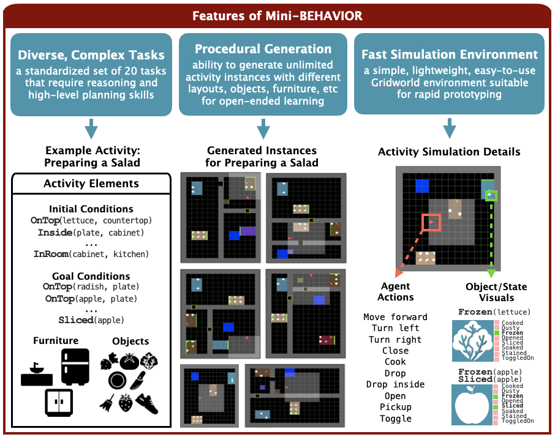
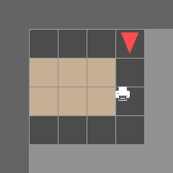

# Mini-BEHAVIOR
Link to paper: https://arxiv.org/abs/2310.01824 

###  MiniGrid Implementation of BEHAVIOR Tasks 


Mini-BEHAVIOR is a simple and easy-to-use high-speed 3D-gridworld environment
with a high-level action space and a set of implementations of long-horizon, interaction-rich BEHAVIOR tasks.
Mini-BEHAVIOR includes 20 tasks of varying difficulty, 96 objects, 23 states, and 15 actions. 
The actions include 3 for navigation (forward, turn left, turn right) and 12 for manipulating objects in the environment 
(pick, place, open, close, etc). 
The tasks are instantiated in simulated household environments.

### Environment Setup
* Install gym-mingrid v1.0.3: 
```
pip install gym-minigrid==1.0.3
```
* Install gym v0.21.0: 
```
pip install setuptools==65.5.0
pip install gym==0.21.0
```
* (Optional) Install stable-baselines3: 
```
pip install stable-baselines3==1.6.2
```
* Install mini-behavior: 
```
pip install -e .
```

### Run Code 
* To run in interactive mode:
```
python manual_control.py
```
* Key Bindings:
  - `up`: move forward
  - `left`: turn left
  - `right`: turn right
  - `0, 1, 2`: pick up object at the corresponding dimension
  - `3, 4, 5`: drop object at the corresponding dimension
  - `i`: drop in
  - `t`: toggle
  - `c`: close
  - `o`: open
  - `k`: cook
  - `s`: slice
* To train a sample RL agent with stable-baseline3 installed:
```
python train_rl_agent.py --task InstallingAPrinter
```
* Example trained RL agent:
<p align="center">
  
</p>

* To collect human demonstrations, run:
```
python manual_control.py --save true
```
* An example code for loading the demos is shown in scripts/load_demos.py

### Action Space Type
Mini-BH supports two types of action spaces: cartesian and primitive. Environment names that ends with v0 correspond to 
primitive actions, while v1 corresponds to cartesian actions. We recommend starting off with primitive actions due to 
its  simplicity and efficiency.

### File Descriptions 
* **mini_behavior/actions.py**
    * Contains base class for actions 
    * All action classes defined here

* **mini_bddl/*.py**
    * Contains all implemented states, actions, and mappings based on original BEHAVIOR BDDL Code

* **mini_behavior/utils/globals.py**
    *  Defines colors, mappings, etc, used for rendering the grid environment

* **mini_behavior/minibehavior.py**
    * Contains base class for mini grid environment
    * Modified to support multiple objects in a tile, generalizability to any actions / states / objects
    * Significant changes made to: grid.set, grid.remove, grid.render_tile, grid.render, minigrid.ste

* **mini_behavior/objects.py**
    * Contains base class for GridWorld objects
    * All object classes defined here

* **mini_behavior/utils/states_base.py**
    * Contains base classes for states (different classes for absolute and relative states)

* **mini_behavior/states.py**
    * All states defined here, inherited from base classes in states_base.py


### Floor plan to Mini-Behavior Environment
* add image file of floor plan to mini_behavior/scenes directory
* run script to process floor plan and save grid to mini_behavior/grids directory: `python convert_scenes.py --imgs IMG_FILENAMES`
* `floorplan.py` will register the floor plan of each `IMG_FILENAME` as an environment with:
    * `id='MiniGrid-IMG_FILENAME-0x0-N1-v0'`
    * `entry_point='gym_minigrid.envs:FloorPlanEnv'`

### Procedural Mini-Behavior Environment Generation

- Add a new json file to mini_behavior/floorplans directory
- Write environment configuration file with environment components needed for the mission, we allow roughly defined configurations such different random environments can be procedurally generated.
- An example configuration file `init_install_printer.json` is provided, the configuration file should follow the same format:
    ```json
    {
        "Grid":
        {
            "mission": str_mission_name, 
            "auto": { 
            "room_split_dirs": ["vert", "horz"], # don't need to change
            "min_room_dim": 1, # minmum room dimension allowed
            "max_num_room": 4 # maximum number of room in the env
            },
            "width": 8, # grid width
            "height": 8, # grid height
        },
        "agents":
        {
            "pos": null, # agent initial position, random generate if null
            "dir": null # agent initial direction,
            random generate if null
        },
        "rooms":
        {
            "num": 1, # number of rooms in the env
            "initial":
            [
                {
                    "top": null, # top left cell x,y coordinates of the room, [x, y], (exclude the walls)
                    "size": null, # size of the room, [width, height],(exclude the walls)
                    "furnitures": 
                    {
                        "num": 3, # number of furnitrues
                        "initial": 
                        [   
                            # first furniture description
                            {
                                "type": "printer", # type of the furniture
                                "state": [["toggleable", 0]], # initial state of the furniture [[state, 0/1]], for not specified states for the furniture, random generate 0 or 1
                                "pos": null, # position of the furniture 
                                "objs": {
                                    "num": 1, # number of objects in the furniture
                                    "initial": 
                                    [
                                        {
                                            "type": "book", # type of the object
                                            "state": [["dustyable", 1]], # initial state of the furniture [[state, 0/1]], for not specified states for the furniture, random generate 0 or 1
                                            "pos": null, # initial position of the object
                                            "objs": null # 
                                        }
                                    ]
                                } # objects on top of the furniture
                            },
                            ... # 2 more furniture descriptions, or if less than 2, random generate till 3 rooms
                        ]
                    }
    }
    ```
- Call `python auto_control.py --seed 100 --auto_env_config /path/to/config.json`, replace the 100 with different seed number to allow different procedural generations, and replace `/path/to/config.json` with the path to the json file, such as `'mini_behavior/floorplans/init_install_printer.json'`.
- After calling the command, a random generated grid will show up, when pressing `backspace`, we can regenearte the environment.

### References
```
@article{jin2023minibehavior,
      title={Mini-BEHAVIOR: A Procedurally Generated Benchmark for Long-horizon Decision-Making in Embodied AI}, 
      author={Emily Jin and Jiaheng Hu and Zhuoyi Huang and Ruohan Zhang and Jiajun Wu and Li Fei-Fei and Roberto Mart{\'i}n-Mart{\'i}n},
      year={2023},
      journal={arXiv preprint 2310.01824},
}
```
